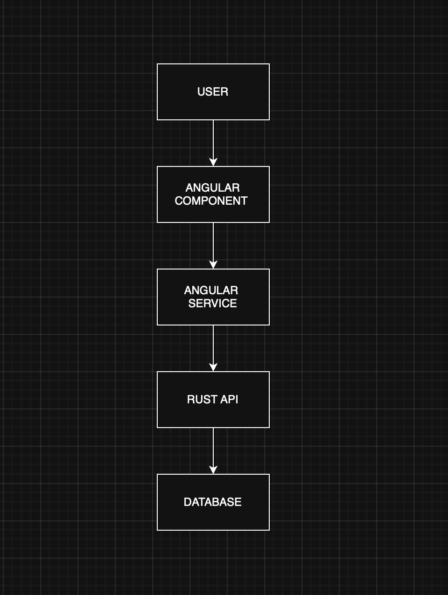

# Understanding Modern Web Architecture with Angular & Rust

## Architecture Overview

This assignment explores how a modern full-stack web application works using Angular for the frontend, Rust for backend APIs, and PostgreSQL as the database. Each layer has a specific responsibility, which helps in building scalable, maintainable, and reliable web systems.

Angular is responsible for the user interface. It uses components to display data and handle user interactions like button clicks, form submissions, and navigation between pages. Instead of directly communicating with the backend, Angular components use services. Services handle HTTP requests using Angular’s HttpClient module and keep business logic separate from UI code.

The backend is implemented using Rust frameworks such as Actix or Axum. Rust receives requests from Angular, validates the input data, processes business logic, and interacts with the PostgreSQL database. Rust is known for its speed, memory safety, and strong type system, which reduces runtime errors and improves application stability.

PostgreSQL acts as the data storage layer. The Rust backend communicates with the database using tools like SQLx or ORM libraries. Data retrieved from the database is sent back as JSON responses, which Angular uses to update the UI dynamically.

This separation between frontend, backend, and database ensures better performance, easier scaling, and a cleaner architecture.

---

## End-to-End Request Flow

When a user interacts with the application, the data flows through several layers:

1. User performs an action such as clicking a button or submitting a form
2. Angular component captures the event
3. Angular service sends an HTTP request to the backend
4. Rust API endpoint receives the request
5. Backend processes validation and business logic
6. Rust queries the PostgreSQL database
7. Database returns results to Rust
8. Rust sends a JSON response back to Angular
9. Angular updates the user interface automatically

This request-response cycle forms the core of most modern web applications.

---

## Role of Typed-Safe Systems

Angular uses TypeScript, which provides type checking during development. This helps catch errors early and improves code readability and maintainability.

Rust provides strong memory safety guarantees and prevents issues such as memory leaks and null pointer errors. Its strict type system ensures predictable backend behavior.

Using both Angular (TypeScript) and Rust together creates a more stable, secure, and reliable full-stack architecture.

---

## Reflection: Importance of Frontend–Backend Separation

Separating frontend and backend improves scalability, maintainability, and performance. Teams can work independently on the user interface and backend logic, making development faster and more organized. It also enhances security because sensitive processing happens on the server instead of the client. Typed-safe technologies like Angular and Rust help reduce runtime bugs and make applications more predictable.

---

## AI Feedback Improvement

This documentation was reviewed using AI feedback to improve clarity, structure, and technical accuracy. Minor refinements were made to simplify explanations and improve readability.

---

## Architecture Diagram

Add your architecture diagram image here.

